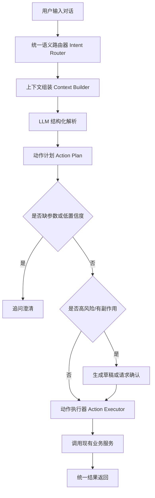

# Insight Spark 智能化优化开发计划

## 1. 背景与目标

当前项目已经具备 Text-to-SQL、预测、预警/警报、业务建模、看板、图表推荐、上传解析、权限、审计、诊断报告等能力，但这些能力大多由各模块独立触发。用户在对话框输入自然语言后，系统经常无法根据真实语义进入正确流程，例如预测需求被当作普通 SQL 查询、建模修改没有进入建模 Agent、预警需求只生成图表而没有创建预警规则。

用户提出的核心要求：

- 用户只需要在对话框输入语句，系统就能根据语义智能判断应该执行什么操作。
- 不仅要优化 Text-to-SQL、预测、预警、警报、建模，还要让项目内其他业务能力也能被自然语言调度。
- 智能化不能停留在关键词匹配，需要真正理解用户语义。
- 需要一份可落地的开发计划，作为后续改造依据。

本计划的目标是将系统从“模块各自猜用户意图”升级为“统一语义路由 + 结构化动作计划 + 后端确定性校验执行 + 多步骤任务编排”的智能 BI 助手。

### 1.1 全局改造约束

智能化优化必须遵守以下约束：

- 不得丢失现有功能。Text-to-SQL、预测、预警/警报、建模、看板、上传、权限、审计、诊断报告等已有功能在改造后仍需保持可用。
- 不得破坏其他模块。新增智能化入口、语义路由和动作编排时，必须保证原有接口、页面流程、数据库结构和业务服务的稳定性。
- 采用渐进式改造。新能力优先通过新增 `ask-smart`、新增 Router、适配现有服务的方式接入，旧接口保留兼容，确认稳定后再逐步替换前端调用。
- 保留兜底路径。LLM 服务不可用、解析失败或低置信度时，应回退到原有查询、规则兜底或澄清流程，而不是中断用户已有功能。
- 所有源码、配置、提示词、测试数据和文档统一使用 UTF-8 编码，避免中文内容、Prompt、JSON Schema、测试样例和日志出现乱码。
- 所有改造必须可回滚、可观测、可测试。每个智能路由决策都应记录来源、置信度、兜底情况和执行结果，便于排查问题。

## 2. 当前问题判断

### 2.1 普通对话默认进入 Text-to-SQL

当前普通对话入口主要先走自然语言生成 SQL。预测、预警、建模等能力没有在对话入口处统一判断，而是分别依赖前端关键词、后端规则或某些结果增强逻辑。

典型问题：

- “预测下个月销售额”可能先被当成普通趋势 SQL。
- “销售额低于 80 万提醒我”可能不会创建预警规则。
- “把销售额口径改成含税收入”如果没有命中建模关键词，可能不会进入模型维护。

### 2.2 多处规则分散，语义判断不一致

目前前端、后端 Controller、AI 微服务中都有意图判断逻辑：

- 前端通过关键词判断是否进入建模 Agent。
- 高级分析 Controller 有预测/推演/预警的兜底正则。
- AI 微服务也有预测/预警/建模的 LLM prompt 和规则兜底。
- Text-to-SQL 服务也会根据问题生成 SQL 和图表。

多处判断会导致同一句话在不同入口下被不同逻辑处理，最终表现为“不智能、不稳定”。

### 2.3 预测和预警触发过度依赖图表结果

普通对话中的自动预测往往依赖：

- 是否生成折线图。
- 图表规则是否开启 prediction。
- 查询结果是否像时间序列。
- 历史点数是否足够。

这不是基于用户语义的稳定触发方式。用户明确说“预测”，系统仍可能因为图表类型或配置不匹配而不预测。

### 2.4 建模内部较智能，但入口仍不够智能

业务建模创建和修改进入 Agent 后，会调用 AI 进行语义拆解。但是否进入建模 Agent 仍主要依赖前端关键词，例如“建模、业务模型、字典、公式、绑定”等。

用户使用更自然的说法时容易漏判，例如：

- “以后销售额就按含税收入算。”
- “把客户分层规则加进去。”
- “这个表按经营口径整理一下。”

### 2.5 缺少语义路由评测

目前缺少覆盖“用户自然语言 -> 期望意图 -> 期望动作”的测试集。没有评测集，就很难持续改进语义能力，也容易出现修好一个场景、破坏另一个场景的问题。

## 3. 总体方案

### 3.1 核心思路

智能化需要 LLM 语义解析，但不能只靠 LLM。

推荐原则：

- LLM 负责理解用户意图、抽取参数、生成结构化动作计划。
- 后端规则负责字段校验、权限校验、风险校验、参数补全、澄清和确认。
- 业务服务负责真正执行操作。
- 所有高风险或有副作用操作必须经过确认或生成草稿。

整体链路：

```text
用户自然语言
  -> 统一语义路由 Intent Router
  -> 结构化动作计划 Action Plan
  -> 参数校验 Slot Validation
  -> 缺参数则澄清 Clarification
  -> 高风险则确认 Confirmation
  -> 动作执行 Action Executor
  -> 返回图表/预测/规则/模型/报告/看板等结果
```

### 3.2 目标架构



### 3.3 新增统一入口

建议新增：

```text
POST /api/chat/ask-smart
```

普通对话框所有请求先进入该接口。旧接口保留作为兼容和兜底。

前端不再负责判断“这句话该进哪个业务模块”，只负责发送问题和渲染结果。

## 4. Intent Router 设计

### 4.1 输入结构

```json
{
  "question": "帮我看最近半年销售额走势，预测下个月，如果低于100万就邮件提醒",
  "tableName": "sales_order",
  "conversationId": 12,
  "parentTurnId": 88,
  "context": {
    "currentTable": "sales_order",
    "currentBusinessModelId": 3,
    "lastChartArtifactId": 21,
    "lastAnalysisType": "forecast",
    "fields": [],
    "businessDictionary": [],
    "availableDashboards": [],
    "userRole": "USER"
  }
}
```

### 4.2 输出结构

```json
{
  "primaryIntent": "MULTI_STEP",
  "confidence": 0.91,
  "needClarification": false,
  "requiresConfirmation": true,
  "actions": [
    {
      "id": "a1",
      "type": "QUERY_SQL",
      "slots": {
        "metric": "销售额",
        "timeRange": "最近半年",
        "groupBy": "月份",
        "chartType": "line"
      },
      "confidence": 0.92
    },
    {
      "id": "a2",
      "type": "FORECAST",
      "dependsOn": ["a1"],
      "slots": {
        "metric": "销售额",
        "horizon": "1m",
        "algorithm": "Prophet"
      },
      "confidence": 0.9
    },
    {
      "id": "a3",
      "type": "ALERT_RULE_CREATE",
      "dependsOn": ["a2"],
      "slots": {
        "metric": "销售额",
        "operator": "lt",
        "threshold": 1000000,
        "channel": "email"
      },
      "requiresConfirmation": true,
      "confidence": 0.88
    }
  ],
  "missingSlots": [],
  "reasoning": "用户同时表达了趋势查询、预测和预警规则创建需求。"
}
```

### 4.3 标准意图枚举

第一批建议支持：

```text
QUERY_SQL
FORECAST
WHAT_IF
ALERT_RULE_CREATE
ALERT_RULE_UPDATE
ALERT_RULE_DELETE
ALERT_EVENT_QUERY
ALERT_EVENT_EXPLAIN
BUSINESS_MODEL_CREATE
BUSINESS_MODEL_PATCH
BUSINESS_MODEL_APPLY
BUSINESS_MODEL_PUBLISH
DASHBOARD_CREATE
DASHBOARD_PIN
DASHBOARD_COMPONENT_UPDATE
CHART_RULE_CREATE
CHART_RULE_UPDATE
DATA_MERGE_PLAN
FIELD_SEMANTIC_FIX
FEDERATED_QUERY
DATASOURCE_JOIN_PLAN
PERMISSION_POLICY_CREATE
PERMISSION_POLICY_EXPLAIN
AUDIT_QUERY
SQL_RISK_EXPLAIN
BUSINESS_DIAGNOSIS
REPORT_GENERATE
FOLLOW_UP_QUERY
ARTIFACT_REUSE
TASK_STATUS_QUERY
TASK_RETRY
COLLABORATION_INVITE
ASSET_SHARE
CLARIFY
MULTI_STEP
NONE
```

## 5. 需要智能化对接的功能范围

### 5.1 已明确需要优化的功能

#### Text-to-SQL 对话查询

目标：

- 只在用户真实意图是查询数据时进入 Text-to-SQL。
- 如果用户意图是预测、预警、建模、看板操作，不应被 Text-to-SQL 吞掉。
- Text-to-SQL 生成结果可以作为后续预测、图表、看板、报告的上游步骤。

#### 预测功能

目标：

- 用户表达“预测、未来、大概能到多少、趋势延伸、下个月会怎样”等语义时触发预测。
- 不依赖图表规则是否刚好开启 prediction。
- 支持基于当前表预测，也支持基于上一轮查询结果预测。

#### 预警功能

目标：

- 用户表达“低于/高于/超过/异常/跌破安全线/通知我/提醒我”等语义时识别为预警规则创建或修改。
- 缺少指标、阈值、渠道时进行澄清。
- 创建规则前生成草稿，高风险操作等待确认。

#### 警报功能

目标：

- 区分“预警规则”和“警报事件”。
- “有哪些异常”“为什么报警”“处理这个警报”应进入事件查询、解释、状态更新。
- “如果低于 80 万提醒我”应进入规则创建。

#### 业务建模功能

目标：

- 创建模型、维护模型、字段绑定、业务字典、业务公式、模型发布/套用都通过语义路由识别。
- 不再依赖前端关键词判断是否进入建模 Agent。

### 5.2 其他也需要智能化对接的功能

#### 看板和图表资产

用户示例：

```text
把刚才这个预测图钉到销售看板
新建一个经营驾驶舱
把这个图改成折线图
给看板加一个华东区域销售趋势
```

对应意图：

```text
DASHBOARD_CREATE
DASHBOARD_PIN
DASHBOARD_COMPONENT_UPDATE
CHART_STYLE_UPDATE
```

#### 图表推荐和图表规则配置

用户示例：

```text
以后问趋势类问题默认用折线图
预测图显示置信区间
明细查询都用表格
```

对应意图：

```text
CHART_RULE_CREATE
CHART_RULE_UPDATE
CHART_RENDER_CONFIG_UPDATE
```

#### 数据上传、字段语义、多文件合并

用户示例：

```text
这两个文件按客户ID合并
把订单日期识别成时间字段
检查字段含义有没有识别错
这个表套用销售分析模型
```

对应意图：

```text
DATA_MERGE_PLAN
FIELD_SEMANTIC_FIX
BUSINESS_MODEL_AUTO_APPLY
DATA_QUALITY_CHECK
```

#### 官方数据源和联邦查询

用户示例：

```text
把我上传的销售表和官方客户表关联分析
用官方区域表补齐省市信息
查这个上传数据和系统订单库是否一致
```

对应意图：

```text
FEDERATED_QUERY
DATASOURCE_JOIN_PLAN
OFFICIAL_DATA_ENRICH
```

#### 权限与数据范围

用户示例：

```text
让华东销售经理只能看华东数据
给运营组开放这个看板
为什么我看不到这个客户的数据
```

对应意图：

```text
PERMISSION_POLICY_CREATE
PERMISSION_POLICY_EXPLAIN
ACCESS_DIAGNOSIS
```

注意：权限变更必须确认，且需要管理员权限。

#### 审计和安全治理

用户示例：

```text
最近有哪些危险查询
谁执行过慢查询
解释这条 SQL 为什么被拦截
```

对应意图：

```text
AUDIT_QUERY
SQL_RISK_EXPLAIN
SLOW_QUERY_ANALYSIS
```

#### 诊断报告

用户示例：

```text
帮我诊断销售额下降原因
生成一份经营分析报告
把这个异常做成诊断报告
```

对应意图：

```text
BUSINESS_DIAGNOSIS
REPORT_GENERATE
ROOT_CAUSE_ANALYSIS
```

#### 会话历史和上下文追问

用户示例：

```text
基于刚才那个图继续分析
把上一轮结果按城市拆开
刚才的预测保存成方案
```

对应意图：

```text
FOLLOW_UP_QUERY
ARTIFACT_REUSE
PLAN_SAVE_FROM_LAST_RESULT
```

#### 任务和批处理

用户示例：

```text
刚才上传处理到哪了
失败的文件为什么失败
重新跑一下上次失败的任务
```

对应意图：

```text
TASK_STATUS_QUERY
TASK_FAILURE_EXPLAIN
TASK_RETRY
```

#### 协作和企业资产

用户示例：

```text
把这个模型发布给团队
复制销售模型给财务使用
让张三一起维护这个看板
```

对应意图：

```text
ASSET_PUBLISH
ASSET_SHARE
MODEL_CLONE
COLLABORATION_INVITE
```

## 6. LLM 使用方式

### 6.1 LLM 只负责解析，不直接执行

LLM 不应直接调用数据库、不应直接操作业务数据、不应直接生成最终高风险操作。LLM 的职责是输出结构化 JSON。

示例：

```json
{
  "primaryIntent": "BUSINESS_MODEL_PATCH",
  "confidence": 0.86,
  "actions": [
    {
      "type": "BUSINESS_MODEL_PATCH",
      "slots": {
        "operation": "UPSERT_METRIC",
        "metricName": "含税销售额",
        "formula": "sales_amt * 1.13"
      }
    }
  ],
  "missingSlots": [],
  "requiresConfirmation": true
}
```

### 6.2 后端必须做确定性校验

必须校验：

- 表是否存在。
- 字段是否存在。
- 字段类型是否匹配。
- 当前用户是否有权限。
- 模型/看板/规则是否属于当前用户或组织。
- SQL 是否只读。
- 阈值、时间范围、渠道是否合理。
- 是否涉及删除、发布、推送、权限变更等高风险动作。

### 6.3 置信度策略

建议：

```text
confidence >= 0.75
  直接执行低风险动作；高风险动作生成草稿并请求确认。

0.45 <= confidence < 0.75
  使用默认值生成草稿，提示用户确认或修改。

confidence < 0.45
  不执行，进入澄清。
```

### 6.4 澄清策略

缺少必要参数时，不要猜测执行。

示例：

```text
用户：帮我做个预警
系统：你想监控哪个指标？例如销售额、利润、库存量。
```

```text
用户：把这个图钉到看板
系统：要钉到哪个看板？我可以选择最近使用的「经营驾驶舱」。
```

## 7. 多步骤任务编排

### 7.1 支持复合语句

用户经常一次提出多个动作：

```text
查最近六个月销售额趋势，预测下个月，如果低于100万就提醒我。
```

系统应拆解为：

```text
QUERY_SQL -> FORECAST -> ALERT_RULE_CREATE
```

### 7.2 Action 依赖关系

每个 action 支持 `dependsOn`：

```json
{
  "actions": [
    {"id": "a1", "type": "QUERY_SQL"},
    {"id": "a2", "type": "FORECAST", "dependsOn": ["a1"]},
    {"id": "a3", "type": "ALERT_RULE_CREATE", "dependsOn": ["a2"]}
  ]
}
```

### 7.3 执行结果聚合

多步骤结果统一返回：

```json
{
  "message": "已完成趋势查询和预测，并生成预警规则草稿。",
  "artifacts": [
    {"type": "CHART", "id": 1},
    {"type": "FORECAST", "id": 2},
    {"type": "ALERT_RULE_DRAFT", "id": 3}
  ],
  "actions": [
    {"label": "确认创建预警规则", "action": "CONFIRM_ALERT_RULE"},
    {"label": "钉到看板", "action": "PIN_TO_DASHBOARD"}
  ]
}
```

## 8. 后端模块设计

### 8.1 新增服务

建议新增：

```text
SmartChatController
IntentRouterService
ContextBuilderService
ActionPlanValidator
ActionExecutorService
ClarificationService
SmartChatTraceService
```

职责：

- `SmartChatController`：统一智能对话入口。
- `IntentRouterService`：调用 LLM 和规则兜底，生成 Action Plan。
- `ContextBuilderService`：收集当前表、字段、模型、会话、上一轮产物、看板等上下文。
- `ActionPlanValidator`：校验 action、slot、权限、风险。
- `ActionExecutorService`：按 action 类型调用现有业务服务。
- `ClarificationService`：生成澄清问题。
- `SmartChatTraceService`：记录路由、置信度、执行结果和失败原因。

### 8.2 复用现有服务

不要重写业务能力，优先复用：

```text
ChatBiService
AdvancedAnalysisService
BusinessModelAgentService
DataUploadService
ChatConversationService
DashboardService / StackCDashboardService
AiChartRuleConfigService
DatasourceService
SqlAuditService
DiagnosisService
Permission 相关服务
```

### 8.3 规则兜底

LLM 不可用或超时时，应使用规则兜底，但规则只作为保守降级：

- 明确“预测/未来/走势” -> `FORECAST`
- 明确“预警/提醒/低于/高于/通知” -> `ALERT_RULE_CREATE`
- 明确“建模/业务模型/公式/字典/绑定” -> `BUSINESS_MODEL_*`
- 明确“钉到看板/保存到看板” -> `DASHBOARD_PIN`
- 其他进入 `QUERY_SQL` 或 `CLARIFY`

规则兜底必须在返回中标记：

```json
{
  "fallbackUsed": true,
  "fallbackReason": "LLM_UNAVAILABLE"
}
```

## 9. 前端改造计划

### 9.1 对话入口统一调用 ask-smart

当前前端不应再通过关键词判断是否进入建模 Agent 或普通 SQL。建议：

```text
sendQuestion -> /api/chat/ask-smart
```

后端返回结果中包含：

```json
{
  "responseType": "FORECAST",
  "message": "",
  "thinkingLogs": [],
  "artifacts": [],
  "actions": []
}
```

前端根据 `responseType` 和 `artifacts` 渲染对应卡片。

### 9.2 统一动作按钮

后端返回可执行动作，前端渲染按钮：

```json
[
  {"label": "确认创建预警规则", "action": "CONFIRM_ALERT_RULE"},
  {"label": "保存预测方案", "action": "SAVE_FORECAST_PLAN"},
  {"label": "钉到看板", "action": "PIN_TO_DASHBOARD"}
]
```

### 9.3 澄清交互

如果返回：

```json
{
  "responseType": "CLARIFICATION",
  "question": "你想监控哪个指标？",
  "options": ["销售额", "利润", "库存量"]
}
```

前端应展示为对话追问，而不是错误。

## 10. Prompt 设计建议

### 10.1 System Prompt

```text
你是企业 BI 系统的语义路由器。你的任务不是回答用户，而是将用户自然语言解析为结构化动作计划。
只能输出严格 JSON。
不要编造不存在的表、字段、看板、模型或规则。
如果缺少必要参数，输出 needClarification=true 和 missingSlots。
涉及删除、发布、权限变更、推送通知、预警规则落库等操作，requiresConfirmation 必须为 true。
```

### 10.2 User Prompt 内容

应包含：

- 用户原始问题。
- 当前数据表。
- 当前会话上下文。
- 可用字段列表。
- 可用业务模型。
- 最近一次图表/预测/规则/报告产物。
- 用户角色和权限摘要。
- 可用意图枚举和 action schema。

## 11. 语义评测集

### 11.1 建议新增文件

```text
insight-spark-backend/src/test/resources/smart-chat-intent-cases.json
```

示例：

```json
[
  {
    "question": "看一下各省销售额排名",
    "expectedPrimaryIntent": "QUERY_SQL"
  },
  {
    "question": "预测下个月销售额",
    "expectedPrimaryIntent": "FORECAST"
  },
  {
    "question": "销售额低于80万提醒我",
    "expectedPrimaryIntent": "ALERT_RULE_CREATE"
  },
  {
    "question": "把销售额绑定到 sales_amt",
    "expectedPrimaryIntent": "BUSINESS_MODEL_PATCH"
  },
  {
    "question": "把刚才这个图钉到销售看板",
    "expectedPrimaryIntent": "DASHBOARD_PIN"
  },
  {
    "question": "查最近6个月趋势并预测下个月",
    "expectedPrimaryIntent": "MULTI_STEP",
    "expectedActions": ["QUERY_SQL", "FORECAST"]
  },
  {
    "question": "让华东经理只能看华东数据",
    "expectedPrimaryIntent": "PERMISSION_POLICY_CREATE",
    "requiresConfirmation": true
  }
]
```

### 11.2 评测指标

建议记录：

```text
intentAccuracy
slotAccuracy
multiStepAccuracy
clarificationPrecision
unsafeActionBlockRate
fallbackRate
```

### 11.3 线上观测

每次智能路由记录：

```text
question
conversationId
primaryIntent
actions
confidence
fallbackUsed
missingSlots
requiresConfirmation
chosenExecutor
success
failureReason
userConfirmed
```

## 12. 分阶段实施计划

### 第一阶段：统一语义路由入口

目标：

- 新增 `/api/chat/ask-smart`。
- 新增 `IntentRouterService`。
- LLM 输出结构化 Action Plan。
- 先支持 `QUERY_SQL`、`FORECAST`、`ALERT_RULE_CREATE`、`BUSINESS_MODEL_CREATE`、`BUSINESS_MODEL_PATCH`、`CLARIFY`。

验收标准：

- 普通对话中输入“预测下个月销售额”能进入预测。
- 输入“销售额低于80万提醒我”能生成预警规则草稿。
- 输入“把销售额绑定到 sales_amt”能进入模型维护。
- 输入普通查询仍能正常走 Text-to-SQL。

### 第二阶段：预测、预警、警报深度接入

目标：

- 预测不再依赖图表规则偶然触发。
- 预警规则创建、修改、删除接入智能路由。
- 预警事件查询、解释、确认、关闭接入智能路由。

验收标准：

- 能区分“创建预警规则”和“查询已有警报事件”。
- 缺少阈值、指标、渠道时能追问。
- 删除规则、推送通知前必须确认。

### 第三阶段：建模智能化入口替换

目标：

- 前端移除或降级 `shouldUseBusinessModelAgent` 等关键词决策。
- 建模创建、模型维护、字段绑定、公式修改、模型套用、发布全部由后端 Router 判断。

验收标准：

- 不含“建模”关键词但表达模型口径修改的语句，也能进入建模维护。
- 发布、删除、套用等动作有确认。

### 第四阶段：看板、图表规则、上传、联邦查询接入

目标：

- 支持自然语言钉图、建看板、修改图表。
- 支持自然语言配置图表推荐规则。
- 支持上传后的字段修正、多文件合并计划、官方数据源关联。

验收标准：

- “把刚才这个图钉到销售看板”能正确复用上一轮 artifact。
- “以后趋势默认折线图”能进入图表规则配置。
- “这两个文件按客户ID合并”能生成合并计划。

### 第五阶段：权限、审计、诊断、任务、协作接入

目标：

- 管理员可通过自然语言查询审计、解释 SQL 风险、配置权限草稿。
- 用户可生成诊断报告、查询任务进度、共享资产。

验收标准：

- 权限变更必须确认并校验管理员权限。
- SQL 风险解释能关联审计记录。
- 上传任务状态能基于会话上下文查询。

### 第六阶段：多步骤编排和持续评测

目标：

- 支持 `QUERY_SQL -> FORECAST -> ALERT_RULE_CREATE` 等复合流程。
- 建立语义评测集和线上路由观测。
- 根据失败样例持续优化 prompt、schema 和规则兜底。

验收标准：

- 多步骤语句能拆解并按依赖执行。
- 语义评测集覆盖主要业务场景。
- 后台能看到路由准确率、兜底率、失败原因。

## 13. 风险与控制

### 13.1 LLM 误判风险

控制方式：

- 输出结构化 JSON。
- 使用置信度。
- 低置信度澄清。
- 后端动作校验。

### 13.2 字段编造风险

控制方式：

- Prompt 中提供字段列表。
- 后端校验字段存在。
- 字段不存在时进入澄清或相似字段推荐。

### 13.3 高风险操作误执行

控制方式：

- 删除、发布、权限变更、推送、预警落库必须确认。
- 默认生成草稿，不直接执行。
- 记录审计日志。

### 13.4 多步骤中间失败

控制方式：

- 每个 action 独立记录状态。
- 支持部分成功和可恢复提示。
- 后续 action 依赖失败时自动停止并解释原因。

## 14. 最终目标效果

用户输入：

```text
帮我看最近半年销售额走势，预测下个月，如果低于100万就邮件提醒。
```

系统应自动完成：

1. 识别为多步骤任务。
2. 查询最近半年销售额趋势。
3. 基于趋势结果执行预测。
4. 生成邮件预警规则草稿。
5. 如果邮件配置完整，请用户确认创建。
6. 返回趋势图、预测解释、预警规则草稿和可执行按钮。

用户输入：

```text
以后销售额就按含税收入算。
```

系统应自动完成：

1. 识别为业务模型口径修改。
2. 定位当前模型和相关字段。
3. 抽取含税销售额公式或请求用户确认税率。
4. 生成模型修改草稿。
5. 用户确认后保存模型。

用户输入：

```text
把刚才那个预测图放到经营驾驶舱。
```

系统应自动完成：

1. 识别为看板钉选。
2. 复用上一轮预测图 artifact。
3. 定位经营驾驶舱看板。
4. 执行钉选或请求确认。

## 15. 一句话结论

要实现真正智能化，项目需要从“各模块分别通过关键词触发”升级为“统一语义路由中心”。LLM 负责理解用户语义并输出结构化动作计划，后端负责校验、确认和执行，现有业务服务负责落地。这样用户在一个对话框里输入自然语言，就能可靠地触发查询、预测、预警、建模、看板、报告、权限、审计、上传处理等一系列系统能力。
